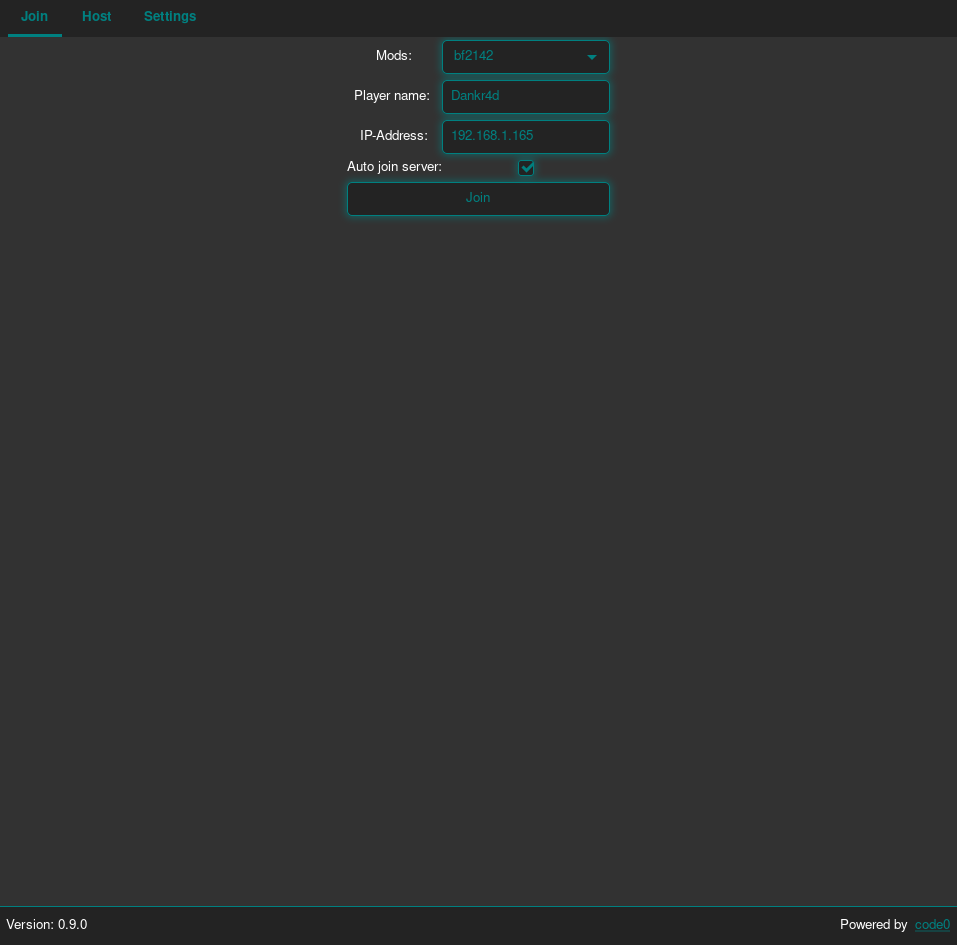
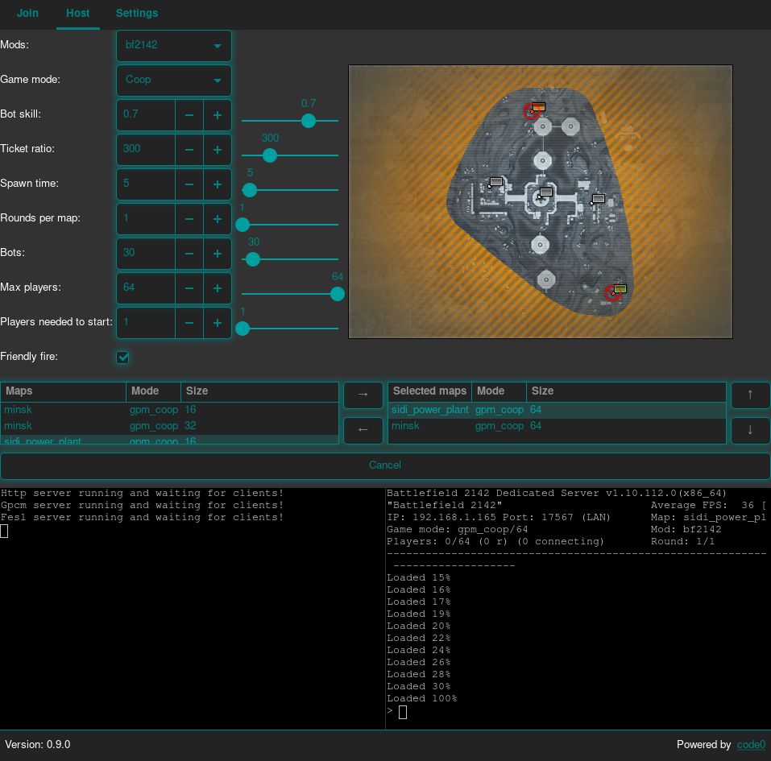
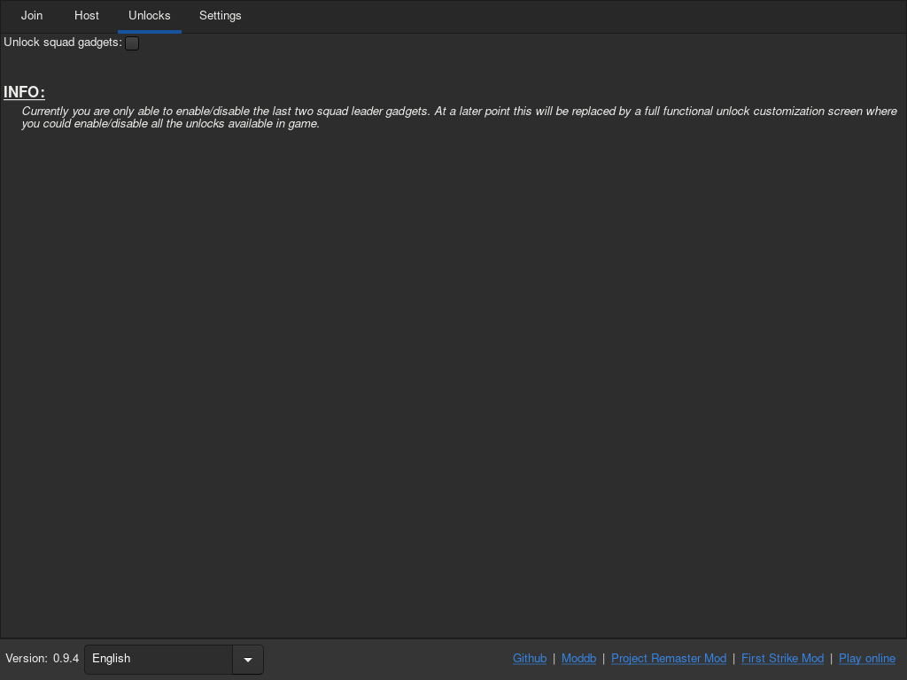
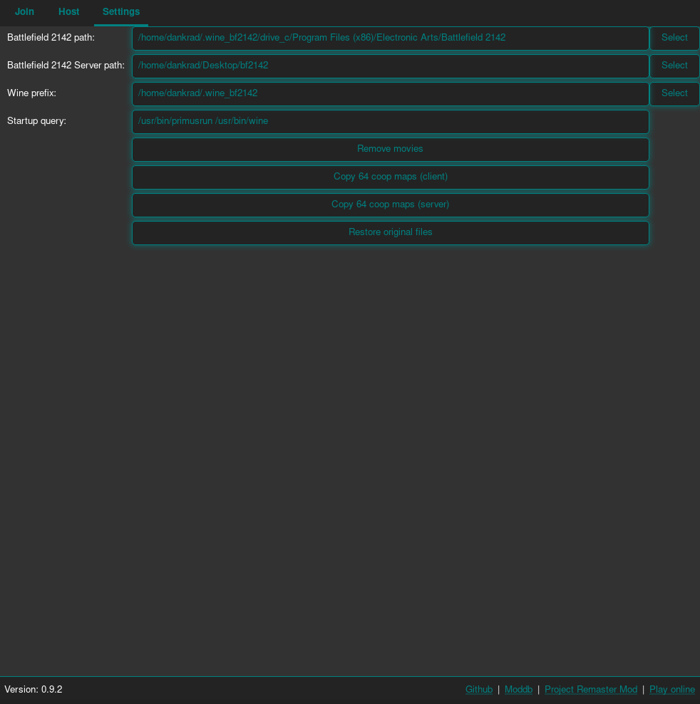
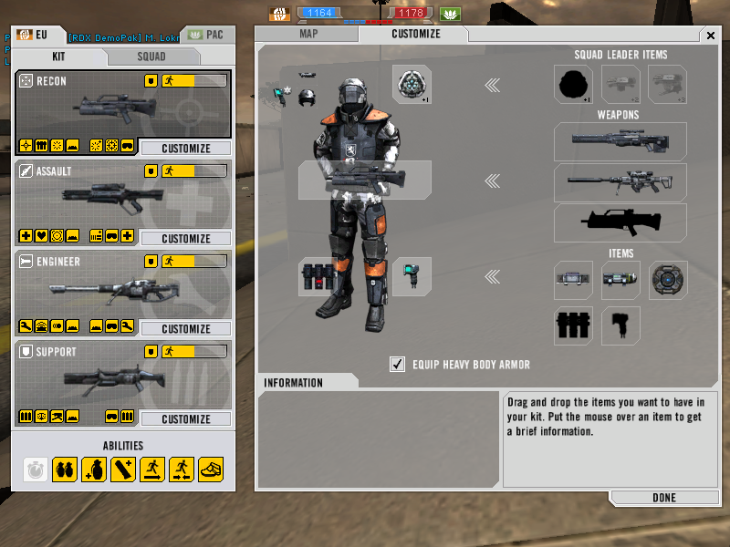
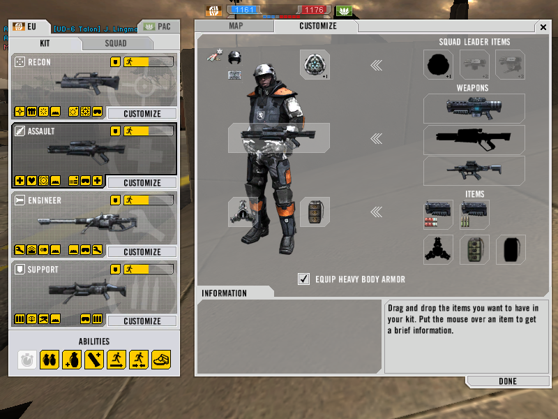
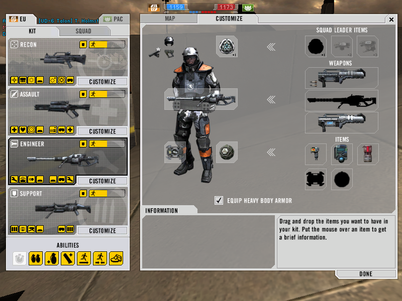
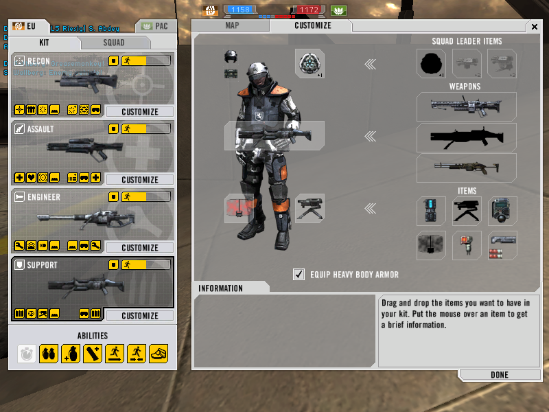

# BF2142 Unlocker

## Description
This project unlock all weapons in Battlefield 2142! You are able to customize your soldier ingame. The squad drones are on default deactivated (you can enable them in "Unlocks" tab). But be warned, bots in vanilla game cannot handle them. This got fixed in Project Remaster mod. 
BF2142Unlocker emulates the necessary login and unlock server to be able to play Battlefield 2142 in singleplayer and multiplayer (also through vpn) with all features. Also you could host a dedicated server with (currently restricted/not all settings are available) gui interface. 

## Requirements:
- Battlefield 2142 updated to version 1.51.

## Downloads
- [Download BF2142 Unlocker v0.9.4 (Windows)](https://github.com/Dankr4d/BF2142Unlocker/releases/download/v0.9.4/BF2142Unlocker_v0.9.4_win.zip)
- [Download BF2142 Unlocker v0.9.4 (Linux)](https://github.com/Dankr4d/BF2142Unlocker/releases/download/v0.9.4/BF2142Unlocker_v0.9.4_linux.zip)

## Instructions / How to play:
- Start the BF2142Unlocker:
  - Windows: BF2142Unlocker.exe
  - Linux: BF2142Unlocker
- Set your Battlefield 2142 path in "Settings" tab.
- Goto "Join" tab and click on "Just play". You'll get logged in and can start playing in singleplayer or multiplayer/lan (with unlocks). Tell your friends your ip address they need to connect to. You can also host the login/unlock server in "Host" tab by clicking on "Host login/unlock server". If you want or need to, you can set your ip address in "Settings" in "Host" tab (you maybe need to scroll down).

## Host dedicated server:
- Set your Battlefield 2142 game serer path in "Settings" tab.
- Goto "Host" tab and enter your IP address in "Server IP-Address" on which the login, unlock and BF2142 game server should listen (it's pre filled with the first ip address BF2142Unlocker could read out). 
  *Info: To play through VPN you need to set the "Server IP-Address" to: 0.0.0.0*
- Goto "Join" tab and click on connect (the ip address is set after you launched the server). Tell your friends the ip address to connect to. 
  *Info: If your hosting through vpn, then you need to enter your private local ip address into "IP-Address" field in "Join" tab. Your friends need to connect to the vpn ip address. Setting "Auto join server" connects you automatically to your game server.*

## Screenshots (Linux version)
### GUI:
|   |   |
| - | - |
|  |  |
|  |  |
### In game:
|   |   |
| - | - |
|  |  |
|  |  |

## Optional requirements
### Battlefield 2142 Dedicated Server
- Windows: ftp://ftp.bf-games.net/server-files/bf2142/Battlefield_2142_Server_Unranked.exe
- Linux: ftp://ftp.bf-games.net/server-files/bf2142/bf2142-linuxded-1.10.112.0-installer.rar
### Mappack for vanilla game
- Goto https://battlefield2142.co/ and click on "Download Map Pack".
- Unzip downloaded mappack.
- Start BF2142Unlocker and go to "Settings" tab.
- Click on "Copy maps to client" and select the Levels folder from extracted zip file (*Warning: Battlefield 2142 client path must be set*).
- Click on "Copy maps to server" and select the Levels folder from extracted zip file (*Warning: Battlefield 2142 server path must be set*).

---

## Compile (Windows 64 bit)
- Install MSYS2 (https://www.msys2.org/) [Do not run "MSYS2 64bit" at the end of installation wizard]
- Start MSYS2 MINGW64
- `pacman -Syu # Upgrade base`
- `pacman -Syu # Upgrade all packages`
- `pacman -S mingw-w64-x86_64-gcc mingw-w64-x86_64-openssl mingw-w64-x86_64-gtk3 mingw-w64-x86_64-python3-gobject make tar git`
- `cd /c/Users/$USER; mkdir projects; cd projects;`
- `git clone -b version-1-2 https://github.com/nim-lang/Nim.git`
- `cd Nim`
- `./build_all.bat # Build nim and all tools (like nimble)`
- `export PATH="$PATH:/c/Users/$USER/projects/Nim/bin"`
- `cd ..`
- `git clone https://github.com/Dankr4d/BF2142Unlocker`
- `cd BF2142Unlocker`
- `nimble install -d # Install dependencies`
- `nimble release # Build BF2142Unlocker and bundle it into "build" folder`

## Compile (Linux)
- Install requierd packages: git gcc make tar wget gtk3 python-gobject vte3
- `nimble install -d # Install dependencies`
- `nimble release # Build BF2142Unlocker and bundle it into "build" folder`

## Compile (Docker)
- `docker-compose up`
- `sh copydockerbuild.sh # Copies the compiled files from the docker container into the local build folder`
