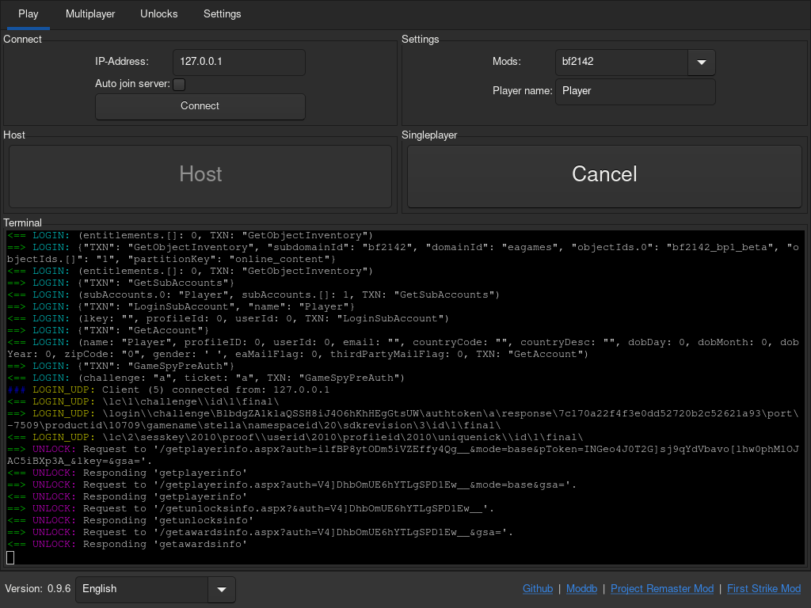
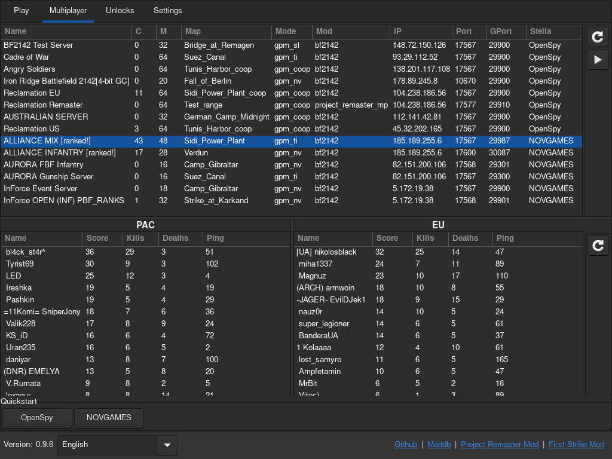
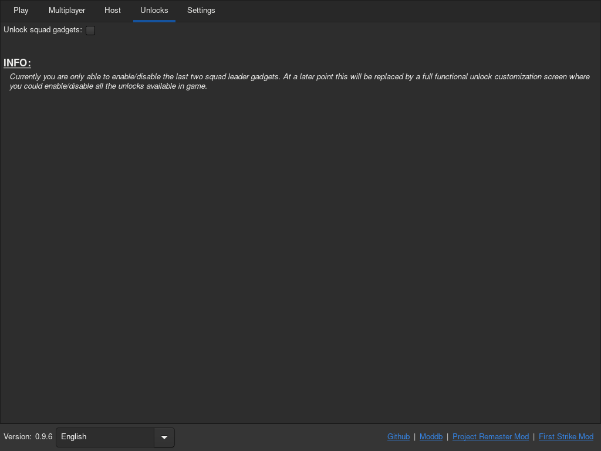
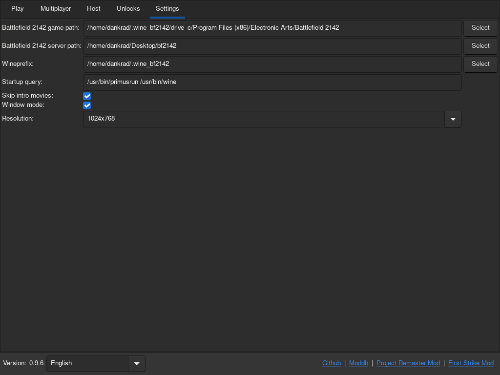

# BF2142 Unlocker

## Description
This project unlock all weapons in Battlefield 2142! You are able to customize your soldier ingame. The squad drones are on default deactivated (you can enable them in "Unlocks" tab). But be warned, bots in vanilla game cannot handle them. This got fixed in Project Remaster mod. 
BF2142Unlocker emulates the necessary login and unlock server to be able to play Battlefield 2142 in singleplayer and multiplayer (also through vpn) with all features. Also you could host a dedicated server with (currently restricted/not all settings are available) gui interface. 
Also the BF2142Unlocker has a multiplayer feature withit you can create accounts, add soldiers and join any server listed in the multiplayer list.  

## Requirements:
- Battlefield 2142 updated to version 1.51.

## Downloads
- [Download BF2142 Unlocker v0.9.5 (Windows)](https://github.com/Dankr4d/BF2142Unlocker/releases/download/v0.9.5/BF2142Unlocker_v0.9.5_win.zip)
- [Download BF2142 Unlocker v0.9.5 (Linux)](https://github.com/Dankr4d/BF2142Unlocker/releases/download/v0.9.5/BF2142Unlocker_v0.9.5_linux.zip)

## Instructions / How to play:
- Start the BF2142Unlocker:
  - Windows: BF2142Unlocker.exe
  - Linux: BF2142Unlocker
- Set your Battlefield 2142 path in "Settings" tab (if BF2142Unlocker couldn't find the installation path).
- Goto "Play" tab and click on "Singleplayer". You'll get logged in and can start playing games against bots in singleplayer.
- Or host your LAN server by clicking on "Host".  Tell your friends your ip address they need to connect to.
- If you want to play on multiplayer servers you maybe need to install custom maps (see bellow "Mappack for vanilla game").
   
  Goto "Multiplayer" tab, double click on any server (or click the play button) and a login window will show up. Enter your login data (or create an account), select or create your soldier and click on "Play". This will start the game, login into your account, select your soldier and connect directly to the game server.
   
  If this feature is broken due login server changes, you can also click on the "Quickstart" button as fallback (this will just patch the BF2142.exe and start the game).

## Host dedicated server:
- Set your Battlefield 2142 game serer path in "Settings" tab.
- Goto "Host" tab, select your mod, create your map list and click on "Host".
- Goto "Play" tab and click on connect (the ip address is set after you launched the server). Tell your friends the ip address to connect to.

## Screenshots (Linux version)
### GUI:
|   |   |
| - | - |
|  |  |
|  |  |
|  | |
### In game:
|   |   |
| - | - |
|  |  |
|  |  |

## Optional requirements
### Battlefield 2142 Dedicated Server
- Windows: ftp://ftp.bf-games.net/server-files/bf2142/Battlefield_2142_Server_Unranked.exe
- Linux: ftp://ftp.bf-games.net/server-files/bf2142/bf2142-linuxded-1.10.112.0-installer.rar
### Mappack for vanilla game
- Goto https://battlefield2142.co/downloads/, download the mappack installer and install it.

---

## Compile (Windows 64 bit)
- Install MSYS2 (https://www.msys2.org/) [Do not run "MSYS2 64bit" at the end of installation wizard]
- Start MSYS2 MINGW64
- `pacman -Syu # Upgrade base`
- `pacman -Syu # Upgrade all packages`
- `pacman -S mingw-w64-x86_64-gcc mingw-w64-x86_64-openssl mingw-w64-x86_64-gtk3 mingw-w64-x86_64-python3-gobject make tar git`
- `cd /c/Users/$USER; mkdir projects; cd projects;`
- `git clone -b version-1-4 https://github.com/nim-lang/Nim.git`
- `cd Nim`
- `./build_all.bat # Build nim and all tools (like nimble)`
- `export PATH="$PATH:/c/Users/$USER/projects/Nim/bin"`
- `cd ..`
- `git clone https://github.com/Dankr4d/BF2142Unlocker`
- `cd BF2142Unlocker`
- `nimble install -d # Install dependencies`
- `nimble release # Build BF2142Unlocker and bundle it into "build" folder`

## Compile (Linux)
- Install requierd packages: git gcc make tar wget gtk3 python-gobject vte3
- `nimble install -d # Install dependencies`
- `nimble release # Build BF2142Unlocker and bundle it into "build" folder`

## Compile (Docker) [Currently not maintained, maybe broken]
- `docker-compose up`
- `sh copydockerbuild.sh # Copies the compiled files from the docker container into the local build folder`
